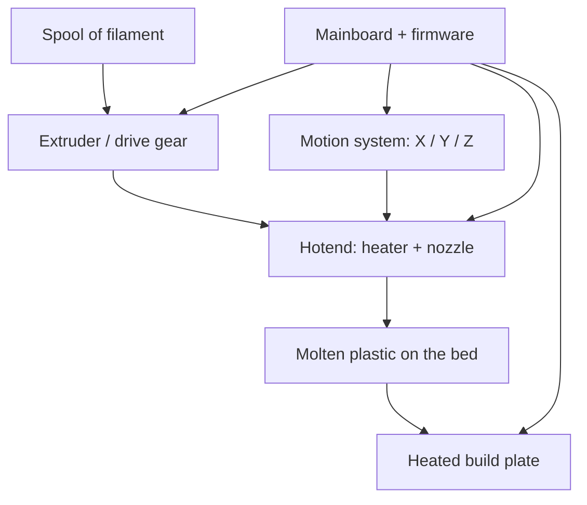
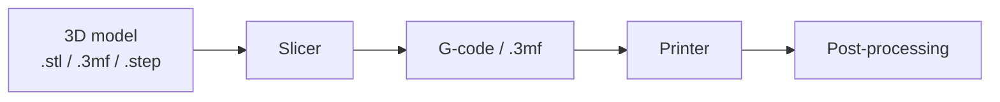

# 3D Printing Basics

The fundamentals of desktop FDM 3D printing — how it works, the parts of a
printer, the model-to-print workflow, and the vocabulary the rest of this section
assumes.

## What is FDM?

**Fused Deposition Modelling (FDM)** — also called Fused Filament Fabrication
(FFF) — builds an object by melting a plastic filament and depositing it in thin
layers. A motor pushes a 1.75 mm filament string into a heated **nozzle**, the
melted plastic is laid down along a path, and the print head moves up one layer
height to draw the next slice. Stack a few hundred layers and you have a physical
part.

It is the most common and affordable form of consumer 3D printing. The main
alternative, **resin (SLA/MSLA)**, cures liquid photopolymer with UV light and
gives far finer detail, at the cost of messier, more toxic handling.

| | **FDM (filament)** | **Resin (SLA/MSLA)** |
|---|---|---|
| Detail | Good; visible layer lines | Excellent; very fine |
| Strength | Strong, functional parts | Often brittle |
| Materials | Huge range (see [Filaments](filaments.md)) | Photopolymer resins |
| Mess / safety | Low | Sticky, toxic, needs gloves + ventilation |
| Best for | Functional parts, prototypes, large prints | Miniatures, jewellery, fine detail |

The rest of this section is about **FDM**.

## Anatomy of a printer

| Part | What it does |
|---|---|
| **Extruder** | Motor + gear that grips and pushes filament. **Direct-drive** mounts it on the print head (better for flexibles); **Bowden** mounts it on the frame and feeds through a tube (lighter head, faster). |
| **Hotend** | Melts the filament. Includes the **heater block**, **thermistor**, **heat break**, and **nozzle**. An **all-metal** hotend is needed for high-temp materials (> ~240 °C). |
| **Nozzle** | The tip the plastic exits. Common sizes 0.4 mm (default), 0.2 mm (detail), 0.6–0.8 mm (fast/strong). Brass is standard; **hardened steel** for abrasive filament. |
| **Build plate / bed** | The heated surface the print sticks to. Surfaces include PEI (spring steel), glass, and textured sheets. |
| **Motion system** | Moves the head in X/Y/Z. **Cartesian/bed-slinger** (bed moves on Y), **CoreXY** (head moves in X/Y, bed only drops — faster, more rigid), or **delta**. |
| **Part-cooling fan** | Blows air on the freshly laid plastic so it solidifies. Critical for PLA/PETG overhangs; turned *down/off* for ABS/ASA/nylon. |
| **Mainboard + firmware** | Runs the printer (Marlin, Klipper, RRF). **Klipper** offloads motion planning to a Raspberry Pi/host for higher speeds and input shaping. |

## The workflow

1. **Get a model.** Download one (Printables, Thingiverse, MakerWorld, Thangs) or
   design your own in CAD (Fusion 360, [Onshape](https://www.onshape.com/),
   FreeCAD, Tinkercad, Blender for organic shapes).
2. **Slice it.** A **slicer** converts the 3D model into **G-code** — the
   layer-by-layer toolpath and machine instructions. Common slicers:
   [OrcaSlicer](https://github.com/SoftFever/OrcaSlicer) (popular, feature-rich),
   PrusaSlicer, Bambu Studio, Cura. Here you set layer height, infill, supports,
   temperatures, and speed (see [Print Settings](print-settings.md)).
3. **Print.** Send the G-code via SD card/USB, or over the network with
   [OctoPrint](https://octoprint.org/), Klipper's web interfaces
   (Mainsail/Fluidd), or the vendor's cloud/app.
4. **Post-process.** Remove supports, peel off the brim, sand, glue multi-part
   prints, vapour-smooth (acetone for ABS, IPA for PVB), or paint.

## Key terms

| Term | Meaning |
|---|---|
| **Layer height** | Thickness of each layer (e.g. 0.2 mm). Smaller = finer detail, more layers, slower. |
| **Infill** | The internal lattice. Given as a percentage (10–20 % typical) and a pattern (gyroid, grid, honeycomb). 0 % is hollow, 100 % is solid. |
| **Perimeters / walls / shells** | The outer loops of each layer. More walls add strength more efficiently than more infill. |
| **Top / bottom layers** | Solid layers that cap the infill. |
| **Adhesion helpers** | **Skirt** (priming loop), **brim** (flat collar for grip), **raft** (full base layer under the part). |
| **Supports** | Scaffolding printed under overhangs steeper than ~45–60°, removed afterwards. |
| **Bridging** | Spanning a gap in mid-air between two points without support. |
| **Retraction** | Pulling filament back to stop oozing during travel moves. Key to fighting stringing. |
| **First layer** | The most important layer — poor bed adhesion or a bad first layer ruins the whole print. |
| **Elephant's foot** | First-layer bulge from heat + weight; reduced with bed-temp and Z-offset tuning. |
| **Slicer** | Software that turns a model into printer instructions (G-code). |
| **G-code** | The text instructions a printer executes (move here, extrude this much, set this temperature). |

## Bed adhesion & the first layer

Most failed prints fail on **layer one**. Getting a good first layer down:

- **Level the bed / set Z-offset.** The nozzle should be exactly the right height —
  too high and lines don't stick; too low and they smear. Many modern printers do
  this automatically with a probe (auto bed levelling / mesh levelling).
- **Clean the plate.** Grease from fingerprints is the #1 adhesion killer. Wipe with
  **isopropyl alcohol**; wash textured/PEI sheets with dish soap occasionally.
- **Right bed temperature** for the material (see [Filaments](filaments.md)).
- **Adhesion helpers** — a **brim** for tall/small-footprint parts; glue stick as
  adhesion (ABS/PC/nylon) or as a **release** layer (PETG on PEI/glass).

!!! tip "Dial in the first layer, once"

    Print a first-layer test or a bed-level pattern when you set up a printer or
    swap surfaces, and note the Z-offset per filament. It saves far more time than
    it costs. See [Print Settings](print-settings.md) and
    [Troubleshooting](troubleshooting.md).

## What you need to start

- A printer. Modern auto-levelling machines (Bambu Lab, Prusa, Creality K-series,
  Sovol) remove most of the old pain of manual tramming and are the easiest entry.
- **PLA** filament to learn on — cheap and forgiving.
- A **slicer** (OrcaSlicer is a great free default).
- Basic tools: a scraper/spatula, flush cutters, a glue stick or IPA, and calipers
  for checking dimensions.

## Sources & further reading

- [Prusa Knowledge Base](https://help.prusa3d.com/)
- [All3DP — 3D Printing for Beginners](https://all3dp.com/2/3d-printing-for-beginners-3d-printing-basics/)
- [OrcaSlicer documentation](https://github.com/SoftFever/OrcaSlicer/wiki)
