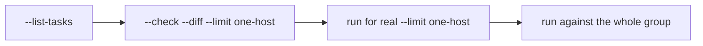

# Ad-hoc Commands & Running Safely

Two things build confidence with Ansible: running quick **ad-hoc** commands to
inspect hosts, and **previewing** changes before you apply them. This page covers
both. For the full list of ready-made commands for this homelab, see the
[Quick Reference](quickref.md).

## Ad-hoc commands

An ad-hoc command runs a **single module** against hosts without writing a
playbook. Format:

```bash
ansible <target> -m <module> -a "<arguments>"
```

```bash
# Connectivity + sudo check (the 'ping' module — not ICMP)
ansible homelab -m ping

# Run a shell command (command module is the default, so -m is optional)
ansible ops-01.internal -a "docker ps"
ansible homelab -a "uptime"

# Use a specific module
ansible ops-01.internal -m service -a "name=docker state=restarted"
ansible ops-01.internal -m ansible.builtin.apt -a "name=htop state=present"

# Print a variable or fact
ansible ops-01.internal -m debug -a "var=ansible_distribution_release"
```

`<target>` is any [inventory](inventory.md) pattern: a host
(`ops-01.internal`), a group (`infra`, `homelab`), or `all`.

!!! note "`-a` commands always say CHANGED"

    The `command`/`shell` modules can't tell whether they changed anything, so
    ad-hoc shell commands report `changed` even when read-only. That's expected —
    see [Writing Tasks → changed_when](writing-tasks.md#controlling-changed-and-failed).

## Check mode — the dry run

`--check` simulates a play: Ansible reports what **would** change but writes
nothing. This is the single most useful habit for running with confidence.

```bash
# Preview the whole base playbook against one host
ansible-playbook playbooks/base.yml --check --limit ops-01.internal
```

Add `--diff` to see the **exact** before/after of every file a `template` or
`copy` task would write:

```bash
ansible-playbook playbooks/base.yml --check --diff --limit ops-01.internal
```

!!! warning "Check mode isn't perfect"

    Some tasks can't be simulated — e.g. a `command` that a later task depends on.
    Those may show as skipped or error under `--check`. It's a preview, not a
    guarantee, but it catches the vast majority of surprises.

## Limiting scope — `--limit`

Never test on everything at once. Target one host first, then widen.

```bash
ansible-playbook playbooks/base.yml --limit ops-01.internal   # one host
ansible-playbook playbooks/base.yml --limit infra             # one group
ansible-playbook playbooks/base.yml --limit '!nas.internal'   # everything except nas
```

## Tags — run part of a play

[Tag your roles/tasks](playbookrunning.md#run-specific-roles-with-tags), then run
or skip subsets:

```bash
# Only the docker role
ansible-playbook playbooks/base.yml --tags docker --limit ops-01.internal

# Everything except borgmatic
ansible-playbook playbooks/base.yml --skip-tags borgmatic

# See which tags exist in a playbook
ansible-playbook playbooks/base.yml --list-tags
```

## Look before you leap

```bash
# Which hosts would this run against?
ansible-playbook playbooks/stacks.yml --list-hosts

# Which tasks would run, in order?
ansible-playbook playbooks/base.yml --list-tasks

# Verbose output: -v (some), -vv (more), -vvv (SSH-level debug)
ansible-playbook playbooks/base.yml -v --limit ops-01.internal
```

## A safe workflow



1. `--list-tasks` — confirm what will run.
2. `--check --diff --limit <one host>` — preview the changes.
3. Run for real against that **one** host and verify it.
4. Widen to the group once you're happy.

Ref: [Ansible — Introduction to ad-hoc commands](https://docs.ansible.com/projects/ansible/latest/command_guide/intro_adhoc.html)
 · [Check mode](https://docs.ansible.com/projects/ansible/latest/playbook_guide/playbooks_checkmode.html)
