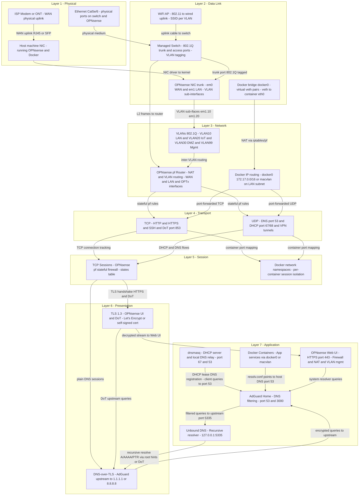

```mermaid
graph TB

    subgraph L7["Layer 7 - Application"]
        AGH["AdGuard Home - DNS filtering - port 53 and 3000"]
        UNBOUND["Unbound DNS - Recursive resolver - 127.0.0.1:5335"]
        DNSMASQ["dnsmasq - DHCP server and local DNS relay - port 67 and 53"]
        DOCKER_APP["Docker Containers - App services via docker0 or macvlan"]
        OPNSENSE_UI["OPNsense Web UI - HTTPS port 443 - Firewall and NAT and VLAN mgmt"]
    end

    subgraph L6["Layer 6 - Presentation"]
        TLS["TLS 1.3 - OPNsense UI and DoT - Let's Encrypt or self-signed cert"]
        DNS_ENC["DNS-over-TLS - AdGuard upstream to 1.1.1.1 or 8.8.8.8"]
    end

    subgraph L5["Layer 5 - Session"]
        SESSIONS["TCP Sessions - OPNsense pf stateful firewall - states table"]
        DOCKER_NET["Docker network namespaces - per-container session isolation"]
    end

    subgraph L4["Layer 4 - Transport"]
        TCP["TCP - HTTP and HTTPS and SSH and DoT port 853"]
        UDP["UDP - DNS port 53 and DHCP port 67/68 and VPN tunnels"]
    end

    subgraph L3["Layer 3 - Network"]
        OPNSENSE_FW["OPNsense pf Router - NAT and VLAN routing - WAN and LAN and OPTx interfaces"]
        VLANS["VLANs 802.1Q - VLAN10 LAN and VLAN20 IoT and VLAN30 DMZ and VLAN99 Mgmt"]
        DOCKER_IP["Docker IP routing - docker0 172.17.0.0/16 or macvlan on LAN subnet"]
    end

    subgraph L2["Layer 2 - Data Link"]
        SWITCH["Managed Switch - 802.1Q trunk and access ports - VLAN tagging"]
        NIC_TRUNK["OPNsense NIC trunk - em0 WAN and em1 LAN - VLAN sub-interfaces"]
        DOCKER_BRIDGE["Docker bridge docker0 - virtual veth pairs - veth to container eth0"]
        WIFI_AP["WiFi AP - 802.11 to wired uplink - SSID per VLAN"]
    end

    subgraph L1["Layer 1 - Physical"]
        CABLE["Ethernet Cat5e/6 - physical ports on switch and OPNsense"]
        ISP["ISP Modem or ONT - WAN physical uplink"]
        HOST_NIC["Host machine NIC - running OPNsense and Docker"]
    end

    ISP -->|"WAN uplink RJ45 or SFP"| HOST_NIC
    HOST_NIC -->|"NIC driver to kernel"| NIC_TRUNK
    CABLE -->|"physical medium"| SWITCH
    SWITCH -->|"trunk port 802.1Q tagged"| NIC_TRUNK
    WIFI_AP -->|"uplink cable to switch"| SWITCH

    NIC_TRUNK -->|"VLAN sub-ifaces em1.10 em1.20"| VLANS
    DOCKER_BRIDGE -->|"NAT via iptables/pf"| DOCKER_IP
    SWITCH -->|"L2 frames to router"| OPNSENSE_FW

    VLANS -->|"inter-VLAN routing"| OPNSENSE_FW
    OPNSENSE_FW -->|"stateful pf rules"| TCP
    OPNSENSE_FW -->|"stateful pf rules"| UDP
    DOCKER_IP -->|"port-forwarded TCP"| TCP
    DOCKER_IP -->|"port-forwarded UDP"| UDP

    TCP -->|"TCP connection tracking"| SESSIONS
    UDP -->|"DHCP and DNS flows"| SESSIONS
    TCP -->|"container port mapping"| DOCKER_NET
    UDP -->|"container port mapping"| DOCKER_NET

    SESSIONS -->|"TLS handshake HTTPS and DoT"| TLS
    SESSIONS -->|"plain DNS sessions"| DNS_ENC

    TLS -->|"decrypted stream to Web UI"| OPNSENSE_UI
    TLS -->|"DoT upstream queries"| DNS_ENC
    DNS_ENC -->|"encrypted queries to upstream"| AGH

    DNSMASQ -->|"DHCP lease DNS registration - client queries to port 53"| AGH
    AGH -->|"filtered queries to upstream port 5335"| UNBOUND
    UNBOUND -->|"recursive resolve A/AAAA/PTR via root hints or DoT"| DNS_ENC
    DOCKER_APP -->|"resolv.conf points to host DNS port 53"| AGH
    OPNSENSE_UI -->|"system resolver queries"| AGH
```