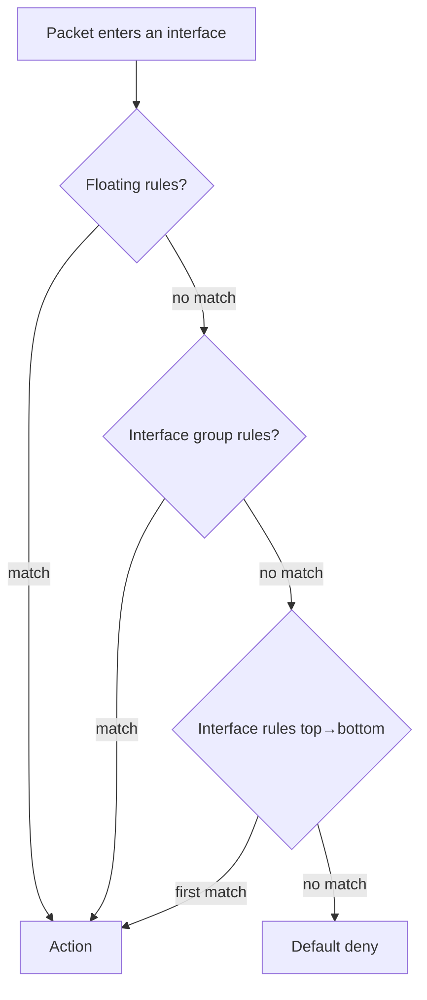

# Firewall Rules & Aliases

This page covers the OPNsense firewall model in general: how rules are processed,
how to keep them maintainable with **aliases**, the different kinds of NAT, and
where to look when something is blocked. For the concrete inter-VLAN ruleset used
here, see [VLANs → Firewall Rules](vlan.md#step-7-firewall-rules).

## How rules are processed

OPNsense is a **stateful** firewall built on pf. Three things to internalize:

1. **First match wins.** Rules on an interface are evaluated **top to bottom**;
   the first rule that matches decides the packet's fate. Nothing below it runs.
   Order matters — put specific blocks above broad allows.
2. **Rules are evaluated on the interface where traffic *enters* the firewall.**
   A rule on the SERVERS tab controls traffic **coming from** the SERVERS network.
   Direction is almost always **In**.
3. **Stateful.** When a rule passes a connection, the reply traffic is allowed
   automatically — you don't write a return rule.



### Rule categories (evaluation order)

| Type | Scope | Use for |
|---|---|---|
| **Floating** | All/selected interfaces, any direction | Global policy, outbound rules, matching across many interfaces at once |
| **Interface group** | All interfaces in a group | Shared policy for several VLANs (e.g. a "LANs" group) |
| **Interface** | One interface | The everyday rules — 99% of what you write |

!!! note "Default deny"

    Anything not explicitly passed is dropped. That's why each VLAN needs at least
    one pass rule to reach the internet — see [the VLAN ruleset](vlan.md#step-7-firewall-rules).

## Rule anatomy — the fields that matter

Beyond the [basic fields](vlan.md#field-reference), a few are worth knowing:

| Field | What it does |
|---|---|
| **Action** | `Pass`, `Block` (silent drop), or `Reject` (send refusal). Use **Block** for security. |
| **Quick** | On = first-match-wins (the default for interface rules). Off (floating) = last match wins. |
| **Source / Destination** | A network, single host, or — much better — an **alias** (below). |
| **Gateway** | Force matching traffic out a specific gateway (**policy-based routing** — e.g. send a VLAN through a VPN). |
| **Reply-to** | Leave default; controls which gateway replies use on multi-WAN. |
| **Log** | Turn on for block rules so you can see what's being dropped. |

## Aliases — name your things

An **alias** is a named group of hosts, networks, or ports you reference in rules
instead of typing raw IPs. This is the single biggest maintainability win: change
the alias once and every rule using it updates.

**Firewall → Aliases → Add.**

| Type | Holds | Example |
|---|---|---|
| **Host(s)** | Individual IPs / hostnames | `srv_omada` = `10.10.30.20` |
| **Network(s)** | CIDR ranges | `net_rfc1918` = `10.0.0.0/8 192.168.0.0/16 172.16.0.0/12` |
| **Port(s)** | Ports / ranges | `ports_web` = `80 443` |
| **URL Table (IPs)** | A URL refreshed on a schedule | A public blocklist of bad IPs |
| **GeoIP** | Whole countries | Block/allow by country |
| **MAC address** | Hardware addresses | Match a device regardless of IP |

Then use the alias name anywhere a source, destination, or port is asked for —
OPNsense autocompletes it.

```
# Instead of this, repeated across many rules:
Destination: 10.0.0.0/8, 192.168.0.0/16, 172.16.0.0/12

# Do this:
Destination: net_rfc1918      ← an alias; edit it in one place
```

!!! tip "Aliases nest"

    An alias can contain other aliases. Build `net_rfc1918` once and reference it in
    every "block to internal" rule (like the [IoT and Guest rules](vlan.md#iot-rules)).
    Aliases also make rules **readable** — `srv_omada` beats a bare IP six months later.

## NAT — the four kinds

**Firewall → NAT.** OPNsense does several distinct things all labelled "NAT":

| Tab | Direction | Purpose |
|---|---|---|
| **Outbound** | LAN → WAN | Masquerades internal IPs behind the WAN IP. Default mode is **Automatic** — leave it unless you need custom rules (then use **Hybrid**). |
| **Port Forward** | WAN → LAN | Expose an internal service on a public port. Also used for the [Force-DNS redirect](opnsense-dns-stack.md#step-4-force-dns-via-nat). |
| **1:1** | bidirectional | Map one public IP to one internal IP, all ports. |
| **NPT** | IPv6 | Prefix translation for IPv6. |

!!! warning "This homelab avoids inbound port-forwards"

    External access here goes through [Cloudflare Tunnels](../cloudflare/index.md) +
    NPM, not WAN port-forwards — nothing inbound is opened on the firewall. The main
    Port Forward rules in use are the **internal** DNS-redirect ones. If you *do*
    forward a port, pair it with a tightly-scoped firewall rule (a specific
    destination alias, not `any`).

### NAT reflection (hairpin)

If an internal client can't reach an internal service by its **public** name/IP,
you need **NAT reflection** (**Firewall → Settings → Advanced → Reflection**). With
split-DNS ([AdGuard rewrites](opnsenseadguard.md#6-local-domains-dns-rewrites))
resolving those names to the internal IP directly, you usually don't — which is
how this network is set up.

## Logging & states

- **Firewall → Log Files → Live View** — watch matches in real time; filter by
  interface, action, or IP. Enable **Log** on block rules so drops appear here.
- **Firewall → Diagnostics → States** — every active connection the firewall is
  tracking. Kill a stuck state here (e.g. after changing a rule) so it re-evaluates.
- A rule change only affects **new** connections; existing states persist until
  they expire or you reset them.

## Best practices

- **Always fill in the description** — future-you maintaining a wall of rules will
  thank you.
- **Alias everything reused** — hosts, port groups, internal ranges.
- **Order: specific blocks → specific allows → broad allows.** First match wins.
- **Log blocks, not passes** (passes are noisy).
- **Back up the config before big changes** — see [Maintenance](maintenance.md).

## Reference

- [OPNsense — Firewall](https://docs.opnsense.org/manual/firewall.html)
- [OPNsense — Aliases](https://docs.opnsense.org/manual/aliases.html)
- [OPNsense — NAT](https://docs.opnsense.org/manual/nat.html)
